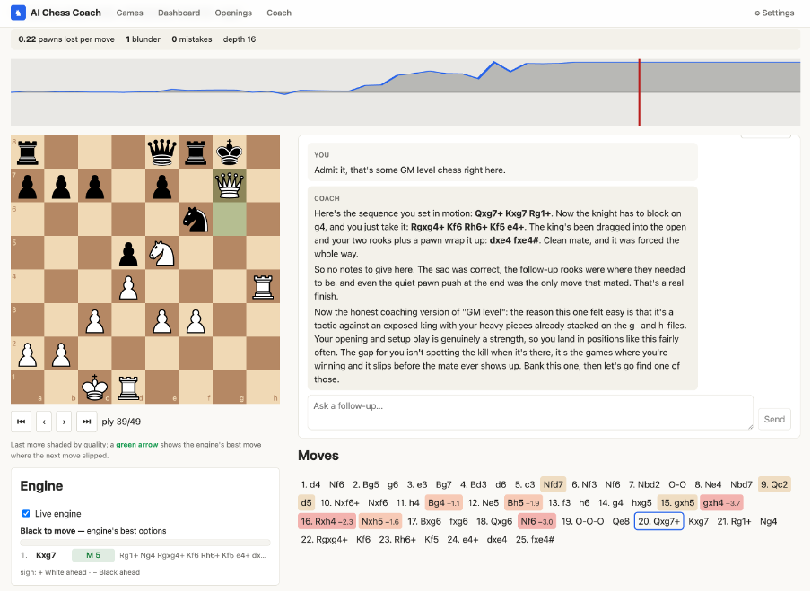
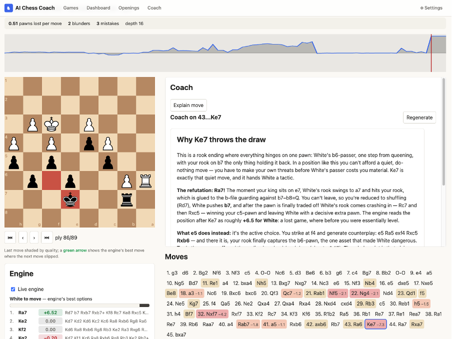
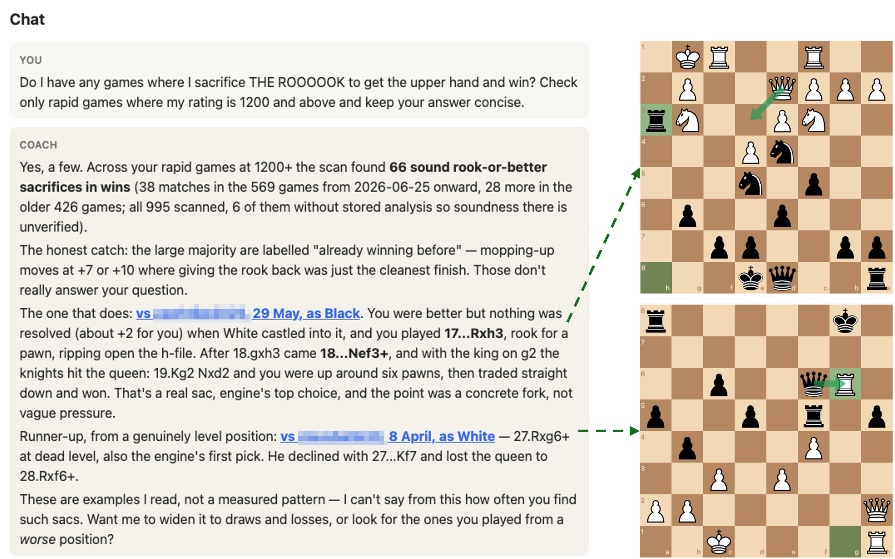

# AI Chess Coach

A web app that pulls your [chess.com](https://www.chess.com) games,
analyzes them with [Stockfish](https://stockfishchess.org), classifies
your openings, and turns the results into LLM coaching advice.

The backend is Python end to end (FastAPI + python-chess); TypeScript
lives only in the `web/` frontend.

## Features

- **Sync**: fetch and cache a chess.com player's games (no auth
  needed) and classify each opening against the lichess ECO database.
- **Analyze**: run Stockfish over every position of a game, flagging
  inaccuracies, mistakes and blunders and computing average loss per
  move by phase, with a live progress stream.
- **Explain a move**: ask the coach what went wrong on any move in an
  analyzed game, and what to play instead.
- **Live eval**: toggle a Stockfish candidate-lines panel for any
  position on the board.
- **Dashboard & report**: rating and activity charts, analysis trends,
  brilliancies and blunders, a weakness report and a per-time-control
  player profile, plus full LLM coaching advice on request.
- **Openings explorer**: drill from the first move into any line, with
  your games, score and eval at every node.
- **Chat**: follow-up questions about a game or a report, answered
  against your own games, repertoire and the engine.

LLM calls only ever fire when you ask for them, and every result is
cached so repeats don't re-bill.

## Screenshots

Chat about any analyzed game, with the eval chart, judged move list
and live engine panel alongside. Here the coach walks through a
queen-sac mating attack:



Ask about a single move and the coach explains it from the engine's
refutation. This one is about the quiet king move that throws a
drawn rook endgame:



Ask across your whole archive — the chat scans every game for sound
rook-or-better sacrifices, separates the real ones from mop-ups, and
cites the exact games it found:



## Prerequisites

- **git** and **make**: install and most commands below are make
  targets. The server will not boot without the lichess opening-book
  submodule, which it loads at startup.
- **[uv](https://docs.astral.sh/uv/)**: it fetches the pinned Python
  3.12 itself, so no system Python is needed.
- **Node 22 LTS** and **[pnpm](https://pnpm.io) 11** (CI's version; the
  committed lockfile needs pnpm 9 or newer).
- **A C++ toolchain, plus `curl` or `wget`** to build Stockfish, which
  downloads its NNUE net during the build. On macOS the Xcode Command
  Line Tools cover git, make, clang and curl in one install.
  Alternatively `brew install stockfish` and set `engine.bin_path`
  (see [Configuration](#configuration)).

Nothing else is needed to sync, analyze, browse openings or read the
report. The LLM features (explain, advice, chat, profile) ride a local
CLI login; see [Coaching](#coaching-llm-providers).

## Quickstart

```bash
git clone https://github.com/ltsaprounis/ai-chess-coach.git
cd ai-chess-coach
make install   # submodules, backend + frontend deps, Stockfish build
```

If only the last step fails you are missing a C++ toolchain, and
everything but engine analysis still works. Build it later with
`make engine`, or install Stockfish yourself and set `engine.bin_path`.

Then run the app. Two ways:

**Whole app on one port** (simplest, good for trying it out):

```bash
make serve   # builds the frontend, then serves UI + API on one port
```

Open **http://localhost:8000**; re-run to pick up frontend changes.

**Frontend dev with hot reload**: run the API and the Vite dev server
side by side (two terminals):

```bash
make dev-api          # API on :8000; leave it running
pnpm --dir web dev    # UI on :5173 (HMR), proxies /api to :8000
```

Open **http://localhost:5173**.

## Coaching (LLM providers)

Two providers work today. Both ride a login you likely already have,
with **no separate billing**:

- **`claude-agent-sdk`** (default): needs the `claude`
  ([Claude Code](https://claude.com/claude-code)) CLI installed and
  logged in.
- **`github-copilot`**: needs the GitHub Copilot CLI installed and
  logged in (`copilot login`). Requests count against your Copilot
  seat.

Configure the coach roster under `coach:` in your config: shape and
rules in [docs/01-config.md](docs/01-config.md), providers in
[docs/06-coach.md](docs/06-coach.md).

## Configuration

Optional: every key has a default (engine depth, thresholds, coach
roster, port, DB path). Copy
[`coach.config.example.yaml`](coach.config.example.yaml) to
`coach.config.yaml` and edit. Two things worth knowing:

- If you use your own Stockfish rather than the build `make install`
  produces, the config is **not** optional: set `engine.bin_path`, or
  every analysis call returns 503.
- Changing `server.port` also means updating the proxy target in
  `web/vite.config.ts` and the API port in `.claude/launch.json`.

## Development

```bash
make check     # backend: ruff check + format check + pyright
               #          + import-linter + pytest
make gen-api   # regenerate the frontend's OpenAPI types after API changes

pnpm --dir web lint && pnpm --dir web typecheck && \
  pnpm --dir web test && pnpm --dir web build
```

Both gates run in CI. `make check` skips the tests marked `engine`,
which need a built Stockfish; run those with
`cd backend && uv run pytest -m engine`. Git hooks are in
[`.pre-commit-config.yaml`](.pre-commit-config.yaml). Install
`pre-commit` separately (it is not a project dependency) and run
`pre-commit install` to activate them.

Only `chess_coach.api` composes the other components; they talk through
shared domain types, with the boundaries enforced by import-linter in
CI. Read [docs/GUIDELINES.md](docs/GUIDELINES.md) before contributing,
and [docs/README.md](docs/README.md) for the architecture. FastAPI's own
API docs are at `http://localhost:8000/docs`.

## License

Copyright (C) 2026 ltsaprounis. Licensed under
[GPL-3.0-or-later](LICENSE), because the project builds on
[python-chess](https://github.com/niklasf/python-chess) and
[Stockfish](https://github.com/official-stockfish/Stockfish), both
GPL-3.
