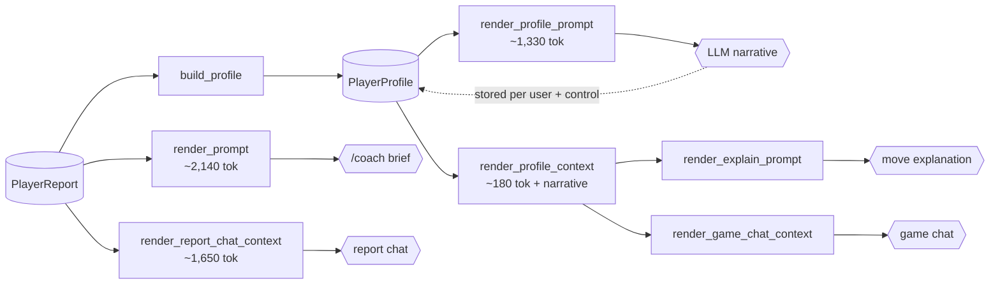

# Prompt hygiene — seven fixes across five templates

Status: audited 2026-07-31, none fixed. All seven are agreed for
fixing in one pass. Nothing here needs new data or new domain types:
every fix is wording, structure, or where a constant is attached.

The audit ran over the branch that added the milestone stats
(`claude/player-profile-stats-8a96e8`), reading the rendered snapshots
in `backend/tests/testdata/` rather than the templates — the snapshots
are what the model actually receives, and two of these findings are
invisible in the source.

Findings 1–4 change model behaviour. 5–7 are hygiene that will matter
the next time someone edits these templates. Severities use the app's
own judgment scale, which is the vocabulary the rest of the project
argues in.

## Read this first

One aggregation feeds every prompt. `PlayerReport` is built once, the
profile is a pure projection of it, and `render_profile_context` is
the only thing that crosses into the per-move prompts.



Everything lives in `backend/src/chess_coach/coach/prompt.py` except
`create_provider`, in `providers.py`. Line numbers below are hints
from the audit and will drift; the function and constant names will
not.

Contracts for all of this are in [06-coach.md](../06-coach.md) —
"Player profile", "Chat", and "Volume and quality". Update it in the
same commit wherever a fix changes a stated contract.

Regenerate every snapshot with:

```
cd backend && UPDATE_SNAPSHOTS=1 uv run pytest -q
```

Then read the diff under `backend/tests/testdata/` as the review
artifact — that is what these files are for.

## 1. The embedded block labels pawns as centipawns (blunder)

`render_profile_context` (`prompt.py:1345`), via
`_profile_quality_line` (`:1213`) and `_profile_recent_line`
(`:1289`). Reaches every explain call and every game-scope chat
message.

Every figure in the block is in pawns — `_pawns_or_na` divides by 100
and its docstring says so. The label says the opposite: ACPL expands
to *average centipawn loss*. The full profile prompt gets away with
this because `_profile_intro` opens with a glossary line; the embedded
block was written without one, and the host prompt then contradicts
it outright:

```
- Quality: 1.07 ACPL overall, 2.6% blunders overall (opening 1.7%, …)
- Recent form (last 30 days): 1.34 ACPL, 3.4% blunders over 8 …
…
Give every evaluation swing in pawns ("about 4 pawns"), never
centipawns.
```

A model reconciling those can only conclude the student loses about
one hundredth of a pawn per move, which is roughly the accuracy of a
top engine.

**Fix.** Spell the unit where the number is, rather than re-adding a
glossary the token budget cannot spare: "1.07 pawns lost per move".
Keep the acronym out of the embedded block entirely — it exists to be
compact, and "ACPL" only saves characters for a reader who already
knows the expansion is wrong here.

**Verify.** `coach_profile_context.md`,
`coach_profile_context_no_narrative.md`,
`coach_explain_prompt_with_profile.md`,
`coach_chat_game_context_with_profile.md`. Add a test asserting the
block never contains the string `ACPL` without a unit beside it.

## 2. The chat seed forbids the model from using the chat seed (blunder)

`_CHAT_INSTRUCTIONS` (`prompt.py:1497`), reaching both chat scopes.

```
- **Claims from tools only.** Any claim about the student's games — a
  result, a move, an opponent, a pattern — must come from a tool
  result returned earlier in this conversation, never from memory of
  the context above or of an earlier turn. Look something up before
  asserting it, or say you don't know.
```

The rule is aimed at invented games and is right to exist. It is not
scoped to them. Read as written:

- **Report scope** ships ~1,650 tokens of ratings, record, repertoire,
  error patterns and turning points, then bans all of it. On the first
  message of a thread no tool has run, so the model may assert nothing
  at all about the student it was just briefed on.
- **Game scope** additionally bans the anchored game's own result,
  opponent and played move, which the seed states three lines above
  the rule, and the profile block's patterns above that.

This predates the profile embed but got worse with it: the "context
above" grew from one game to a full student briefing.

**Fix.** Carve out the seed. The distinction the rule wants is
*stated* versus *recalled*, not context versus tools — something like:
the facts stated in this context are established and may be used and
quoted; anything beyond them (another game, another result, a move
not shown here) must come from a tool result, or be declined.

Keep the game-links rule as it is: ids genuinely must come from tool
results, because the seed's own game is already linked by the UI.

**Verify.** `coach_chat_game_context.md`,
`coach_chat_game_context_with_profile.md`,
`coach_chat_report_context.md`. `test_coach_chat.py:118` asserts the
literal string `Claims from tools only`; rename the bullet and that
assertion moves with it.

## 3. Nothing tells the explainer to use the profile (mistake)

`_EXPLAIN_INSTRUCTIONS` (`prompt.py:1381`).

The block is prepended to every explain prompt and no instruction
refers to it. The entire documented payoff of the embed — 06-coach.md
promises "explain this move *to a player who hangs pieces to back-rank
checks and plays the London*" — rests on the model choosing to use
unexplained context. The same omission exists in `_CHAT_INSTRUCTIONS`,
where finding 2 argues against using it.

**Fix.** One clause in the explain instructions: pitch the
explanation at the student the profile describes, and say so when the
move is an instance of a pattern the profile already counts. Resist
more than that — the instruction block is the one part of this prompt
with a strict length budget, and the profile is context, not the
subject.

**Verify.** `coach_explain_prompt_with_profile.md`. Note the
instruction is shared with the no-profile prompt, so word it to read
correctly when no profile block is present, or render it
conditionally.

## 4. One persona is doing three different jobs (mistake)

`SYSTEM_PROMPT` (`prompt.py:69`), attached in `create_provider`
(`providers.py:1310`) to the provider that serves report advice,
profile narratives *and* move explanations.

```
You are a strong, practical chess coach reviewing a student's
engine-analyzed games. Every figure in the brief below is already
move-weighted and carries its own denominator … respond with the
coaching brief only, no preamble …
```

A move explanation is not a brief and carries no figures to
re-average. A profile narrative is a briefing *about* the student for
another coach, not a brief *for* them — and its own instructions
already say so, under a system prompt that says something else.

Chat already has its own persona (`CHAT_SYSTEM_PROMPT`) for exactly
this reason; the precedent is set.

**Fix.** Either generalise the wording ("respond with the requested
artifact only, following the instruction block at the end") or add
`EXPLAIN_SYSTEM_PROMPT` and `PROFILE_SYSTEM_PROMPT` and pass the right
one per call. The second is more code: `create_provider` builds one
provider with one system prompt, so a per-call persona means changing
the `CoachProvider` seam. Prefer generalising unless the personas
genuinely need to diverge.

**Verify.** No snapshot covers this — `SYSTEM_PROMPT` is passed to the
provider, not rendered into any template, which is why the audit only
caught it by reading `create_provider`. If it stays a single constant,
add a test that it does not name a specific artifact.

## 5. The block opens on a pronoun with no antecedent (inaccuracy)

`_profile_scope` (`prompt.py:829`), used by
`render_profile_context`'s header.

```
## Student profile -- their rapid games
```

"Their" refers to nobody: the block never names the student, and it is
the *first* line of the prompt. The username appears further down, in
the host template. `PlayerProfile.username` is right there, and the
full profile prompt already uses it in its own header.

**Fix.** Name them — `## Student profile -- testuser, rapid games`.
Watch that `_profile_scope` is shared with `render_profile_prompt`,
whose intro already names the student and reads correctly with the
pronoun ("Covering their rapid games"); either give the context block
its own header helper or make the shared one take the name.

**Verify.** All four profile-bearing snapshots.

## 6. Model-written markdown is pasted in with no fence (inaccuracy)

`render_profile_context`, final lines.

The stored narrative is appended raw under `Coach's read:`, between
two `##` sections of the host prompt. Nothing constrains its
structure: `_PROFILE_INSTRUCTIONS` (`prompt.py:1125`) asks for three
to five sentences plus a short bullet list, and never forbids a
heading. A narrative that opens `## Tendencies` forges a section
boundary in every prompt that embeds it, and the sections after it
read as belonging to the narrative rather than to the host.

**Fix.** Block-quote the narrative on the way in (`> ` per line), so
its extent is unambiguous whatever it contains. Optionally also
forbid headings in `_PROFILE_INSTRUCTIONS` — belt and braces, but see
the version note below before touching that constant.

**Verify.** `coach_profile_context.md` and the two host snapshots.
Add a test embedding a narrative that contains `## Heading` and assert
the host's own sections survive.

## 7. The brief switches person mid-document (inaccuracy)

`_student_section` (`prompt.py:176`), `_repertoire_section` (`:506`),
`_INSTRUCTIONS` (`:98`).

The data addresses the student — "Systems you chose", "You played
**7.Qd2**" — while the instructions in the same document discuss them
in the third person: "raise this student's results", "an opening is
the student's own". Explain and both chat seeds are third person
throughout, so the brief is also the odd one out across the set.

Both registers are defensible on their own. Having both in one
document is what is not, and the milestones section added on this
branch already went subject-free rather than pick a side.

**Fix.** Lowest priority of the seven; do it last or drop it. The data
sections are the cheaper side to move — headings and labels only —
and the output register (second person, to the student) must not
change: that is what the UI renders and it is deliberate
(06-coach.md, "Narrative", contrasts it with the profile's third
person).

**Verify.** `coach_prompt.md`, `coach_chat_report_context.md`.

## Version bumps and caches

- **`PROMPT_VERSION`** (`prompt.py:50`) keys the advice cache. Fix 7
  changes `render_prompt`, so bump it. Fix 4 changes the persona
  behind cached advice without touching the template — bump for that
  too, or the cache serves advice produced under a different system
  prompt.
- **`PROFILE_PROMPT_VERSION`** (`:65`) is row metadata, never a cache
  key. Only fix 6's optional "no headings" clause touches
  `render_profile_prompt`; bump if you take it. Fixes 1, 5 and 6's
  main change all live in `render_profile_context`, which the stored
  narrative does not depend on — no bump, nothing re-bills.
- **Explanations do not version at all.** `explanations` keys on
  `(game_id, ply, agent_id)` (`storage/explanations.py`), so every
  explanation cached today keeps serving the pre-fix text until
  someone hits refresh. Fixes 1, 3 and 5 therefore reach new
  explanations only. This is the same gap
  [prompt-version-fingerprint.md](prompt-version-fingerprint.md)
  exists to close; if that lands first, these fixes propagate on their
  own.
- **Chat seeds are rebuilt per message**, so fix 2 reaches every
  existing thread on its next turn.

## Suggested order

1. Fix 5 and 6 (profile context structure), then 1 (units) — all three
   land in `render_profile_context` and share four snapshots, so doing
   them together means reading one diff instead of three.
2. Fix 2, then 3 — both are instruction blocks, and 2 removes the rule
   that would otherwise contradict 3.
3. Fix 4 — decide generalise-vs-split first; it is the only one that
   may touch the provider seam.
4. Fix 7 last, with the `PROMPT_VERSION` bump, since it is the
   largest snapshot churn and the least behavioural payoff.

## What not to "fix"

The audit checked these and they are correct as they stand. Changing
them would undo a deliberate decision documented in
[06-coach.md](../06-coach.md):

- **Report-scope chat does not embed the profile block.** The report
  is what the profile is projected from; embedding it would state the
  same aggregates twice and invite the model to reconcile two
  renderings of one number.
- **The embed resolves the game's own time control**, falling back to
  the all-controls row, and the header states which. A bullet game is
  never silently explained against rapid numbers.
- **`append_game_links` strips model-authored `[gN]:` definitions**
  before appending its own, so a citation handle cannot be forged from
  inside the advice.
- **The narrative is third person and the brief is second person.**
  Different readers — the narrative is stored and pasted into prompts
  read by another coach, the brief is read by the student. Finding 7
  is about mixing registers *within* the brief, not about aligning the
  two documents.
